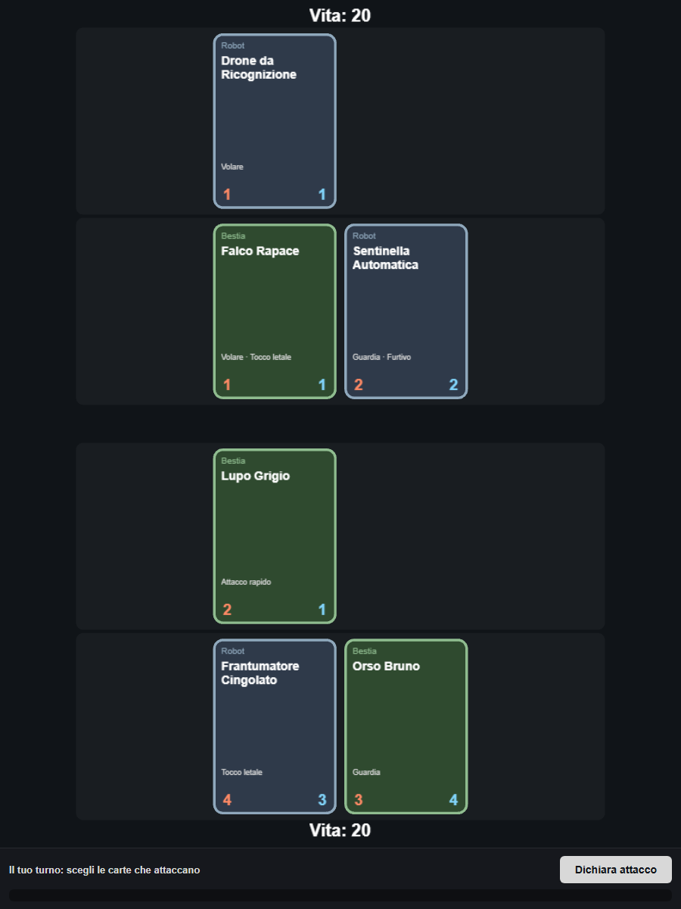
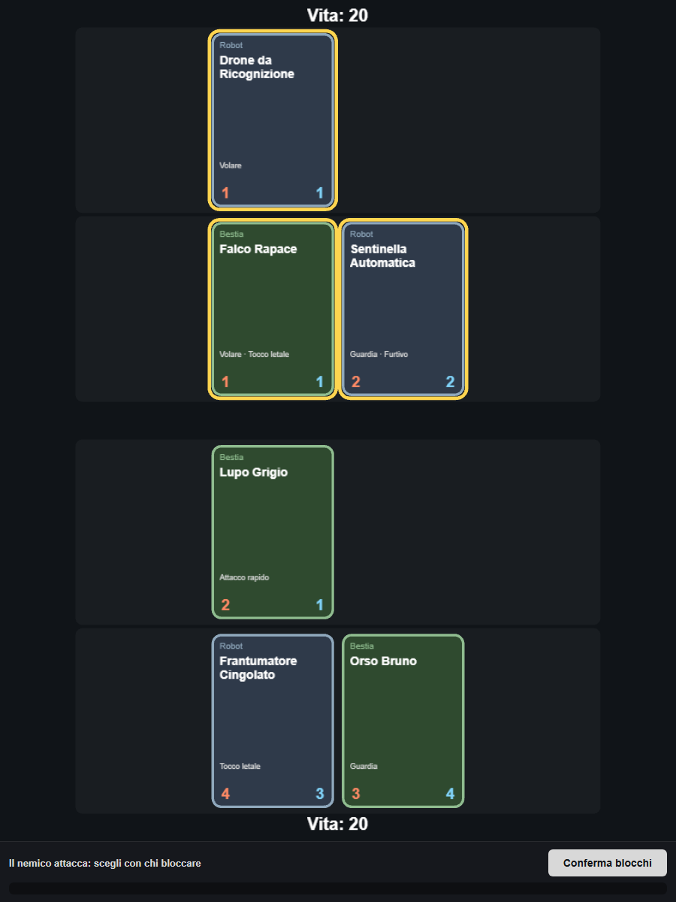

# Drift

Prototipo di card game 1v1 ispirato a *Inscryption*: creature contrapposte su un
tabellone diviso in due corsie (mischia e distanza), con fasi di
attacco/difesa in stile Magic. Il motore di gioco è **data-driven**: le carte
sono definite in JSON e caricate a runtime, senza logica hard-coded per
singola carta.



## Concept

Ogni giocatore controlla un lato del tabellone diviso in due file:

- **Mischia** (`Melee`)
- **Distanza** (`Ranged`)

Una carta piazzata in una corsia può attaccare o bloccare solo un'altra carta
della stessa corsia: un mostro a distanza non intercetta un attacco in
mischia e viceversa. Non c'è ancora un mazzo/mano/risorsa: il prototipo attuale
mette in scena solo il **loop di combattimento**, con un board demo già
popolato all'avvio (`Game.populateDemoCards`).

## Regole di turno (stile Magic)

Il turno alterna sempre due fasi, prima per un giocatore poi per l'altro:

1. **Fase di attacco** — il giocatore attivo sceglie quali delle proprie
   carte non "tappate" attaccano (`selectedAttackers`). Le carte scelte
   vengono tappate e non potranno bloccare al turno successivo.
2. **Fase di blocco** — il difensore assegna, una alla volta, le proprie
   carte non tappate agli attaccanti dichiarati, rispettando le regole di
   legalità (`canBlock` in [combat.ts](src/game/combat.ts)):
   - stessa corsia (mischia/mischia, distanza/distanza);
   - un attaccante **Furtivo** non può essere bloccato da nessuno;
   - un attaccante **Volare** può essere bloccato solo da un bloccante che
     vola a sua volta.

Dopo la conferma dei blocchi (`resolveCombat`):

- gli attaccanti non bloccati infliggono danno diretto alla vita del
  difensore;
- gli attaccanti bloccati duellano con il proprio bersaglio: il danno è
  simultaneo, tranne per le carte con **Attacco rapido** che colpiscono
  prima e possono uccidere il bersaglio senza subire contraccolpo;
  **Tocco letale** rende letale qualsiasi danno inflitto, indipendentemente
  dal valore di attacco;
- le carte con difesa a 0 muoiono e vengono rimosse dal tabellone.

Il turno passa quindi al lato opposto, che va a sua volta in fase di
attacco (solo le sue carte si "stappano": non esiste uno step di untap
condiviso, `untapSide` viene chiamato solo per il lato che sta per attaccare).
La partita finisce quando la vita di un giocatore (partono entrambi da 20)
scende a 0 o sotto.

### Il modificatore Guardia

Una carta **Guardia** non tappata, se ha almeno un bersaglio legale tra gli
attaccanti dichiarati, **deve** comparire tra i blocchi: il pulsante di
conferma resta disabilitato finché l'obbligo non è soddisfatto
(`guardObligationsSatisfied`). È l'opposto della "menace" di Magic: qui è la
carta difensiva ad essere costretta a intervenire, non l'attaccante a
richiedere più bloccanti.


*Il nemico ha dichiarato l'attacco (contorno giallo); il giocatore assegna i
propri bloccanti tra le carte disponibili nella corsia corrispondente.*

## Modificatori disponibili

| Modificatore | Effetto |
| --- | --- |
| `FLYING` (Volare) | Può essere bloccato solo da un'altra carta che vola |
| `DEADLY` (Tocco letale) | Qualsiasi danno inflitto da questa carta è letale |
| `GUARD` (Guardia) | Deve bloccare se ha un bersaglio legale disponibile |
| `STEALTH` (Furtivo) | Non può essere bloccato da nessuna carta |
| `FIRST_STRIKE` (Attacco rapido) | Infligge danno prima del normale scambio di colpi |

Definiti in [types/card.ts](src/types/card.ts), applicati in
[game/combat.ts](src/game/combat.ts).

## Avversario

L'avversario è gestito da un'IA elementare ([game/ai.ts](src/game/ai.ts)):
attacca sempre con tutto ciò che è disponibile e, in difesa, prima soddisfa
gli obblighi di Guardia poi blocca ciò che può bloccare legalmente. Non c'è
ancora alcuna valutazione strategica dei trade.

## Architettura

```
src/
  types/card.ts       Definizione dati carta (CardData) e modificatori
  data/cards/*.json    Set di carte data-driven (beast.json, robot.json)
  data/cardLoader.ts   Accesso tipizzato ai set di carte
  game/
    CardInstance.ts    Istanza runtime di una carta (attacco/difesa correnti, tap)
    BoardState.ts       Stato puro del tabellone: 4 file, vita, slot
    combat.ts           Regole di blocco/Guardia e risoluzione del combattimento
    ai.ts               IA elementare per attacchi e blocchi dell'avversario
  board/
    Board.ts            Container Pixi che dispone le 4 corsie e il testo vita
    Lane.ts             Una singola corsia (fila di slot) e le sue CardView
  render/
    CardView.ts          Rendering Pixi di una singola carta
    frames.ts            Stile visivo (colori/etichetta) per tipo di carta
  app/Game.ts           Macchina a stati del turno (attacco/blocco), collega
                         input DOM (HUD) e interazioni sul tabellone Pixi
  main.ts               Entry point, monta Game nel div #app
```

Il rendering del tabellone è interamente su **canvas Pixi.js**; l'HUD
(stato testuale, pulsante azione, log eventi) è invece HTML/CSS sovrapposto
al canvas, definito in [index.html](index.html) e collegato da `Game.ts`.

## Dati delle carte

Le carte non hanno codice dedicato: sono record JSON in
[src/data/cards/](src/data/cards/), uno per tipo (`beast.json`, `robot.json`),
caricati da [cardLoader.ts](src/data/cardLoader.ts). Aggiungere una carta
significa aggiungere una voce con `id`, `name`, `type`, `attack`, `defense`
e un array di `modifiers` — nessuna modifica al motore è necessaria finché
il comportamento desiderato è già coperto dai modificatori esistenti.

```json
{
  "id": "beast_bear",
  "name": "Orso Bruno",
  "type": "beast",
  "attack": "3",
  "defense": "4",
  "modifiers": ["GUARD"]
}
```

Il tipo (`beast`/`robot`) determina solo lo stile visivo della cornice
([render/frames.ts](src/render/frames.ts)), non ha ancora un ruolo
meccanico.

## Sviluppo

```bash
npm install
npm run dev       # server di sviluppo Vite su http://localhost:5173
npm run build     # type-check + build di produzione
npm run preview   # serve la build di produzione
```

Stack: TypeScript, [Vite](https://vite.dev/), [Pixi.js](https://pixijs.com/) v8.

## Stato attuale e limiti noti

Questo è un prototipo del solo loop di combattimento:

- il tabellone di partenza è fisso (`populateDemoCards`), non c'è ancora
  mazzo, mano, pescata o costo/risorsa per giocare le carte;
- l'IA avversaria non valuta i trade, applica solo le regole di legalità;
- solo due tipi di carta (bestia, robot) e cinque modificatori: il set di
  dati è volutamente piccolo per validare il motore prima di espanderlo.
