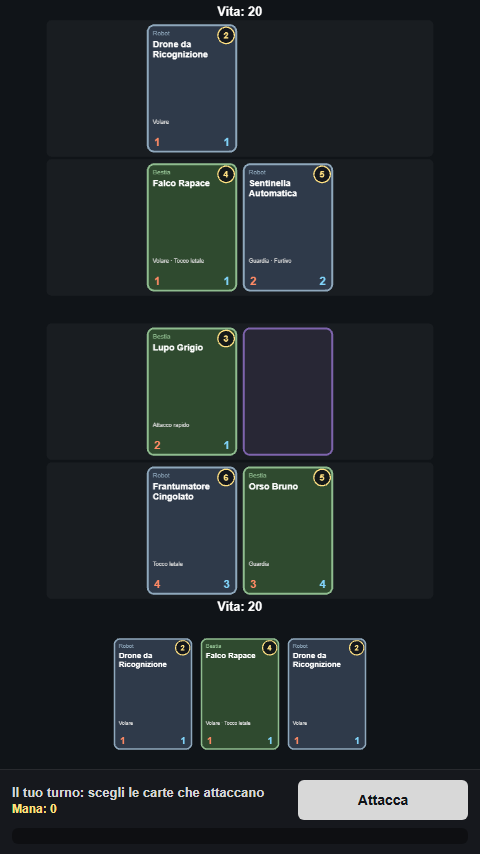
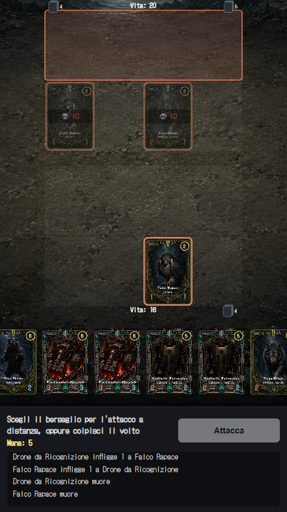
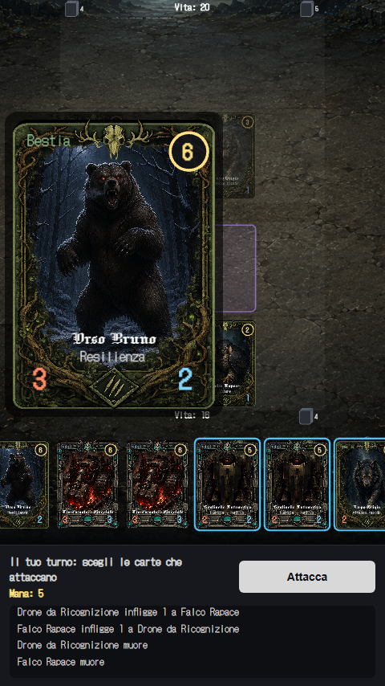
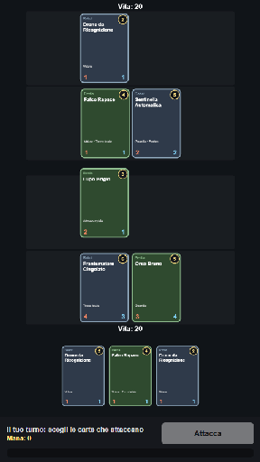
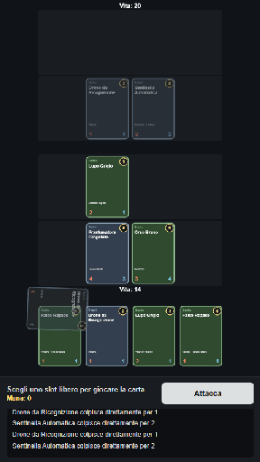

# Drift

A 1v1 card game prototype built with **Pixi.js** and **TypeScript**, combining
positional melee combat with free-target ranged attacks across a two-lane
board. The engine is fully **data-driven**: cards, decks, art and animations
are all defined outside the game logic, so new content never requires touching
the combat rules.



## Concept

Each player controls two lanes:

- **Melee** — front line, fixed by column: a melee card can only fight the
  enemy melee card directly across from it.
- **Ranged** — back line, free targeting: a ranged card can strike *any*
  enemy card (or the enemy's face) regardless of column, but deals damage in
  one direction only — the target never strikes back.

This asymmetry is the core risk/reward of the game: ranged cards hit harder
and pick their targets, but a lane full of enemy ranged attackers can all
focus-fire the same card, with no artificial damage penalty needed to balance
it — the exposure is already built into "no retaliation."

If a melee slot is empty, the ranged card behind it can be brought forward
into the front line (manually for the player, automatically for the AI) to
plug the gap.

## Turn flow

Play alternates between the two sides. On your turn:

1. A card is drawn and mana is refreshed (mana equals the number of turns
   you've taken, so it grows by exactly 1 every turn regardless of what you
   spent).
2. Optionally play cards from hand into empty slots, spending mana per the
   card's cost.
3. Choose your attackers:
   - Clicking an untapped **melee** card immediately marks it as attacking
     (its target is fixed — whatever sits in the same column).
   - Clicking an untapped **ranged** card arms it for targeting: legal enemy
     cards light up individually, and if an enemy lane has *no* creatures in
     it at all, that whole lane lights up as a single target that strikes
     the face directly. A lane with even one creature in it only offers
     that creature — no sniping the face past a defended lane.
   - Any card that would be lethal to its (would-be) target shows a **💀 KO**
     marker on the target, so you can preview the outcome before confirming.
4. Press **Attack** to resolve combat, or **Cancel** to clear your current
   selection without untapping/unplaying anything. Attacking taps a card for
   the rest of the round.

Combat resolves in this order: melee duels (First Strike sub-phase first,
then the rest, simultaneously) → deaths are removed → ranged strikes →
deaths are removed again. The turn then passes to the other side, which goes
through the same steps (driven by the AI for the opponent).

The game ends when either side's health (starting at 20) reaches 0.

## Modifiers

| Modifier | Effect |
| --- | --- |
| `FLYING` | A melee attack from this card skips the column matchup and hits the face directly, *unless* the defending column also has a Flying card, in which case they duel normally. |
| `STEALTH` | A melee attack from this card always skips the column matchup and hits the face directly — no exception. |
| `DEADLY` | Any damage this card deals is instantly lethal, regardless of amount. |
| `GUARD` | This card cannot be chosen as a ranged target (it can still be attacked in melee via its column). |
| `FIRST_STRIKE` | Deals its melee damage in an earlier sub-phase, before all other melee duels resolve. |
| `REGENERATION` | Recovers 1 defense at the start of each of its owner's turns, if damaged — capped at its starting defense. |
| `RESILIENCE` | Fully resets to its starting defense at the start of each of its owner's turns — damage never carries over. |
| `SPAWN` | At the start of each of its owner's turns, adds a copy of `spawnCardId` to that player's deck. |
| `DOUBLE_ATTACK` | A melee attack from this card hits both neighboring columns (not the one directly across). |
| `TRIPLE_ATTACK` | A melee attack from this card hits its own column plus both neighbors. |
| `EMPOWERMENT` | When played, gains +1 attack (permanently) for each copy of `empowerCardId` already on its owner's board. |

Combat damage to defense is otherwise permanent: a card that survives a fight stays wounded turn after turn unless it has one of the two modifiers above. A wounded card's defense number renders in red instead of blue as a visual reminder.

Modifiers are defined in [types/card.ts](src/types/card.ts) and interpreted
by [game/combat.ts](src/game/combat.ts) — adding a new one only requires a
label and the corresponding branch in the combat resolver.

## Opponent AI

The opponent ([game/ai.ts](src/game/ai.ts)) runs a simple deterministic
routine each turn:

1. **Reinforce** — pull a ranged card forward into any empty melee slot in
   its column.
2. **Play** — from its hand, play the cheapest cards first into empty slots
   (melee before ranged) until it runs out of mana or slots.
3. **Attack** — attack with everything untapped; ranged attackers prioritize
   the enemy card with the lowest remaining defense, falling back to the
   face once no card targets are left.

There's no trade evaluation or lookahead — it's a baseline opponent, not a
strategic one.

## Tower Climb

The second game mode: an endless run across a branching map of nodes
([game/towerMap.ts](src/game/towerMap.ts)) instead of one-off matches. Each
map is 4 layers × 3 lanes, always connected by construction (every node
links to the same lane next layer, and a 50% chance of an adjacent one too),
funneling into a single boss node. Beating the boss doesn't end the run — it
generates a fresh map and keeps going, so a climb only ends when you lose.

Node types, picked by weighted random roll:

| Node | What happens |
| --- | --- |
| `fight` | A standard match against a random enemy deck. |
| `empowered` | Same, but against a bigger enemy deck (16 vs 12 cards) and a 1.5x score multiplier. |
| `boss` | Enemy deck drawn only from cost-5+ cards, 2x score multiplier. |
| `add_card` | Pick 1 of 3 random cards from the whole catalog to add to your run deck (or discard an existing one if you're at the 20-card cap). |
| `sacrifice` | Remove a modifier-bearing card from your deck to graft its modifier onto another card. |
| `fusion` | Merge two identical copies of a card into one with double stats and +1 cost. |

`sacrifice` and `fusion` produce one-off synthetic cards (ids like `sac:0`,
`fuse:1`) registered at runtime via
[`cardLoader.registerCustomCard`](src/data/cardLoader.ts) — they exist only
for that run's deck and are never added to the permanent collection.

Floor score ([game/towerScoring.ts](src/game/towerScoring.ts)) starts from a
fixed base and is eroded by turns taken and damage received, with a small
bonus for finishing with a health margin. Losing (or drawing) ends the run
and records the final score to the local leaderboard
([game/Leaderboard.ts](src/game/Leaderboard.ts), top 10, no backend).

## Deck Builder & progression

Your collection and deck persist in `localStorage`
([game/PlayerProfile.ts](src/game/PlayerProfile.ts)): up to 3 copies
unlocked per card, up to 20 cards in your deck. Tower Climb rewards
(`add_card` nodes) unlock cards into this permanent collection even if that
particular run is later lost. The Deck Builder screen also lets you export
your save to a JSON file and re-import it (e.g. to move progress to another
browser) — see "Esporta/Importa salvataggio" in its HUD.

## Card preview and feedback

Long-pressing any card — in hand or on the board, yours or the opponent's, or
a tile in the Deck Builder or Tower Climb — pops up an enlarged preview (left
side for your cards, right side for the opponent's during a match; centered
everywhere else) so you can read small text without losing your place.
[`render/cardPreview.ts`](src/render/cardPreview.ts) builds the enlarged
view once and is reused by every screen that needs it.




## Animations

Combat and card placement are animated with **GSAP**:

- Melee attackers lunge toward their target; ranged attackers recoil and
  fire a traveling streak toward theirs.
- Cards shake when they take damage, and a floating damage number pops up
  at the point of impact.
- Cards that die fade out before being removed from the board.
- Cards dealt from hand (or drawn by the AI) fly from their origin to their
  resting slot instead of appearing instantly — from the hand for the
  player, dropping in from above the board for the AI.
- A direct hit to a player's face makes the health number "punch" alongside
  its damage popup.

The board locks interaction (except the long-press preview, which stays
available even mid-replay) while an animated combat sequence plays out, so
you always see the full story of a turn before acting again.




## Visual identity

### Card art pipeline

Cards render with real art when available and fall back to a plain
programmatic frame otherwise — nothing has to opt in or out of art support.
Adding art for a card is just dropping a correctly-named PNG in place:

```
src/assets/cards/
  backs/<type>.png       card back, one per card type
  frames/<type>.png      full-card frame illustration, one per card type
  art/<card id>.png      illustration, one per card (e.g. beast_wolf.png)
```

[`render/cardAssets.ts`](src/render/cardAssets.ts) uses `import.meta.glob` to
discover these files automatically at build time — the same "no code change
needed" spirit as the JSON card data below. All discovered textures are
preloaded once via `Assets.load` at startup (`Texture.from` alone does not
trigger a fetch for an unregistered URL, which is a Pixi.js gotcha worth
knowing if textures render blank).

Frames are full-card illustrations with a free-form transparent window cut
into the middle (not a plain rectangle), so [`CardView`](src/render/CardView.ts)
covers the *entire* card in "cover" mode (scaled uniformly, cropped, never
stretched) and lets the frame's opaque border mask it for free — whatever
art sticks out past the window just sits behind the painted border. The art
sprite carries its own rounded-rect mask (matching the frame's corner
radius) so it never bleeds past the card's rounded silhouette into a lane's
background.

### Fonts

Two self-hosted, subsetted Google Fonts, loaded via the `FontFace` API and
awaited before the first scene mounts ([render/fonts.ts](src/render/fonts.ts)):

- **Jacquard 12 / 24** (blackletter, pixel-edged) for titles, menu entries,
  card names, and other primary choices (Tower Climb nodes, modal panel
  buttons). 24 is only used for the "DRIFT" home screen title; 12 for
  everything else at this weight.
- **DotGothic16** (dot-matrix) for everything else — stats, HUD, log,
  descriptions. It replaced an earlier pick (Pixelify Sans) whose stylized
  digits made "2" and "8" (and "5" and "S") visually indistinguishable at
  the sizes cards use — a real problem in a game whose cards are covered in
  numbers.

`CardView`'s text renders at `resolution: 2` so it stays crisp when scaled
up in the long-press preview instead of upscaling a low-res canvas.

### Per-scene backgrounds

Each scene can set its own background image via `BaseScene.setBackground(key)`,
which looks up `src/assets/ui/backgrounds/<key>.png`
([render/sceneBackgrounds.ts](src/render/sceneBackgrounds.ts)) — same
discovery-by-filename convention as card art. It scales to cover the screen
without distortion and re-fits on resize. A scene with no matching file
just keeps the app's base background color.

## Card and deck data

Cards have no per-card code: they're JSON records in
[src/data/cards/](src/data/cards/), one file per type, loaded by
[cardLoader.ts](src/data/cardLoader.ts):

```json
{
  "id": "beast_wolf",
  "name": "Lupo Grigio",
  "type": "beast",
  "attack": "2",
  "defense": "1",
  "cost": "3",
  "modifiers": ["FIRST_STRIKE"]
}
```

Mana cost is authored by hand per card (`cost` field) rather than derived
from stats, so balance stays under direct control as the card pool grows.

Decks are simple ordered lists of card ids
([src/data/decks/](src/data/decks/)), shuffled at the start of the match by
[game/Deck.ts](src/game/Deck.ts).

## Architecture

```
src/
  types/card.ts        Card data shape and modifiers
  data/
    cards/*.json         Card set, data-driven (beast.json, robot.json)
    decks/*.json         Deck lists (ordered card ids)
    cardLoader.ts         Typed access to the card set + runtime-registered custom cards
    enemyDecks.ts          Random/empowered/boss enemy deck generation
  game/
    CardInstance.ts       Runtime instance of a card (current atk/def, tapped, cost)
    BoardState.ts          Pure board state: 4 lanes, health, slots
    Deck.ts                 Shuffled draw pile
    deckRules.ts             Shared deck-size/copy-limit constants
    combat.ts               Combat resolution and modifier rules
    ai.ts                   Opponent: reinforce / play / attack
    TowerRun.ts              State for one Tower Climb run (map, score, deck)
    towerMap.ts               Branching node-map generation and node resolution
    towerScoring.ts            Floor score formula
    towerRewards.ts             Random reward-card picking
    PlayerProfile.ts           Persisted collection + deck (localStorage)
    Leaderboard.ts              Persisted top-10 Tower Climb scores (localStorage)
  board/
    Board.ts              Pixi container laying out the 4 lanes and health text
    Lane.ts                A single lane (row of slots), its CardViews, and the whole-lane ranged target
  hand/
    HandView.ts           Player's hand of cards
  render/
    CardView.ts            Pixi rendering of a single card, incl. long-press gesture
    cardAssets.ts           Art/frame/back asset discovery and preloading
    sceneBackgrounds.ts      Per-scene background discovery and preloading
    fonts.ts                 Font loading (FontFace API) and family constants
    frames.ts               Fallback programmatic frame style per card type
    cardPreview.ts           Shared enlarged-card-preview builder (long-press)
    cardGrid.ts              Shared fixed-column card grid layout (Tower Climb pick screens)
    animations.ts            GSAP animation helpers (lunge, shake, fade, streak, popups)
    OverlayPanel.ts           Reusable modal panel (title/subtitle/buttons)
  app/
    SceneManager.ts        Owns the Pixi Application; mounts/unmounts scenes
    scenes/
      BaseScene.ts             Shared scene boilerplate: mount/unmount, resize, per-scene background
      BoardInteractionController.ts  What's clickable/highlighted on the board + hand, and the preview gesture
      CombatAnimator.ts         Replays combat events as an animated sequence
      MainMenuScene.ts, MatchScene.ts, DeckBuilderScene.ts, LeaderboardScene.ts
      TowerMapScene.ts, towerFlow.ts, TowerRewardScene.ts, TowerDiscardScene.ts,
      TowerSacrificeScene.ts, TowerFusionScene.ts, TowerGameOverScene.ts
  main.ts                 Entry point: preloads textures/fonts, wires SceneManager to #app
```

The board itself renders entirely on a **Pixi.js canvas**; the HUD (status
text, mana, action buttons, event log) is HTML/CSS overlaid on top, defined
in [index.html](index.html) and populated per-scene into the `#hud-root` div
that [`SceneManager`](src/app/SceneManager.ts) hands each scene — see
[main.ts](src/main.ts) for the entry point that wires it all together.

## Development

```bash
npm install
npm run dev       # Vite dev server
npm run build     # type-check + production build
npm run preview   # serve the production build
```

Stack: TypeScript, [Vite](https://vite.dev/), [Pixi.js](https://pixijs.com/) v8,
[GSAP](https://gsap.com/) v3.

## Current state and known limitations

- Only two card types (beast, robot) — the data set is intentionally small
  to validate the engine before expanding it.
- The AI opponent has no trade evaluation or lookahead: it plays cheapest
  cards first and always attacks with everything untapped.
- No matchmaking or multiplayer — human vs AI only. Collection, deck, and
  leaderboard persist locally via `localStorage` (export/import as JSON to
  move a save between browsers), but there's no account or server sync.
- No sound design yet.
